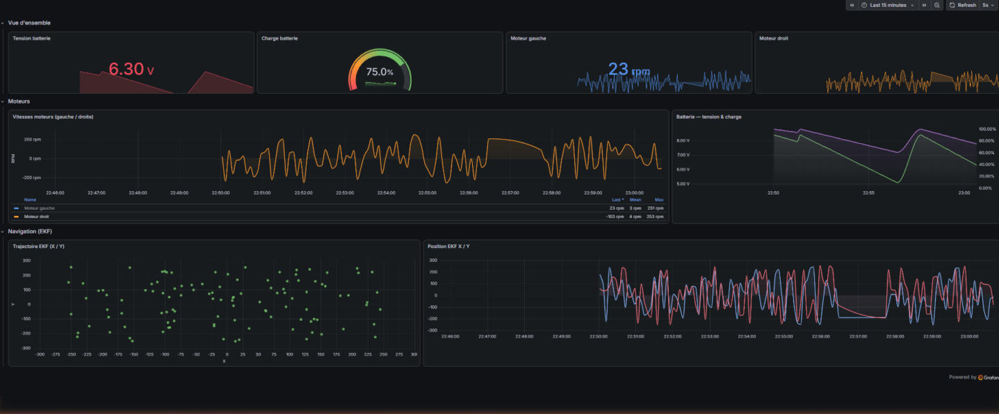
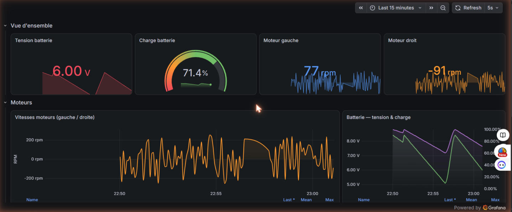
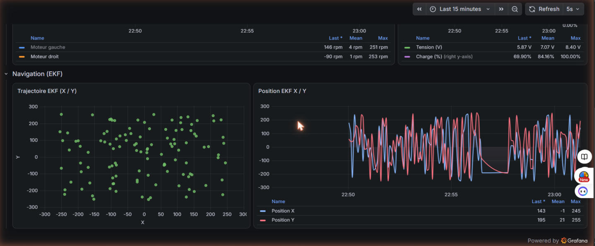

# Digital Twin — Robot Mini Sumo IIoT

## Ce que ça démontre

Démonstrateur IIoT industriel complet : acquisition de données temps réel depuis un robot embarqué (ESP32), pipeline de données bout en bout MQTT → InfluxDB → Grafana, visualisation et alertes automatisées, le tout déployé dans une infrastructure conteneurisée (Docker Compose).

Ce projet illustre les compétences clés de l'**Industrie 4.0** : intégration de capteurs embarqués, transport de données via protocole industriel (MQTT), stockage en séries temporelles, supervision à distance et détection d'anomalies.

---

## Architecture

```
ESP32 (capteurs + EKF)
        │
        │ MQTT (topic: robot/telemetry)
        ▼
  Mosquitto Broker
        │
        │ MQTT subscribe
        ▼
  Bridge Python (bridge.py)
        │
        │ InfluxDB write API
        ▼
  InfluxDB 2.0 (bucket: telemetry)
        │
        │ Flux queries
        ▼
  Grafana (dashboard + alertes)
```

---

## Stack technique

| Composant | Technologie |
|-----------|-------------|
| Embarqué | ESP32, C++ (PlatformIO), FreeRTOS |
| Protocole messaging | MQTT (Mosquitto) |
| Bridge | Python 3, paho-mqtt, influxdb-client |
| Stockage | InfluxDB 2.0 (séries temporelles) |
| Visualisation | Grafana (Flux queries, alertes) |
| Infrastructure | Docker Compose |

---

## Données supervisées

- **Batterie** : tension (V), charge (%), état critique
- **Moteurs** : vitesse gauche/droite (RPM)
- **Navigation EKF** : position x, y, orientation θ
- **Lidar** : distance, angle, validité
- **IMU** : accéléromètre (ax, ay, az), gyroscope (gx, gy, gz)
- **Capteurs de ligne** : détection bord du dohyo

---

## Lancer l'infrastructure

```bash
cd digital-twin
docker compose up -d
```

Démarre automatiquement : Mosquitto (port 1883), InfluxDB (port 8086), Grafana (port 3000).

Lancer le bridge :
```bash
python bridge.py
```

---

## Dashboard Grafana

- **Vue d'ensemble** : tension et charge batterie en temps réel avec alertes visuelles
- **Moteurs** : courbes vitesses gauche/droite superposées
- **Navigation EKF** : trajectoire XY du robot dans l'arène + courbes temporelles
- **Alerte** : notification automatique si charge batterie < 60%







---

## Auteur

Sylvain Ngacham — Étudiant en génie électrique, spécialisation IIoT / Jumeaux numériques industriels  
Trois-Rivières, Québec
